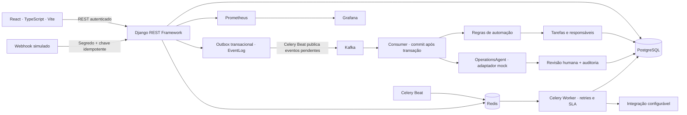
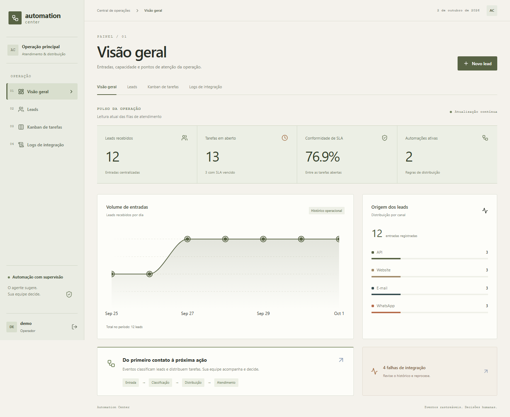
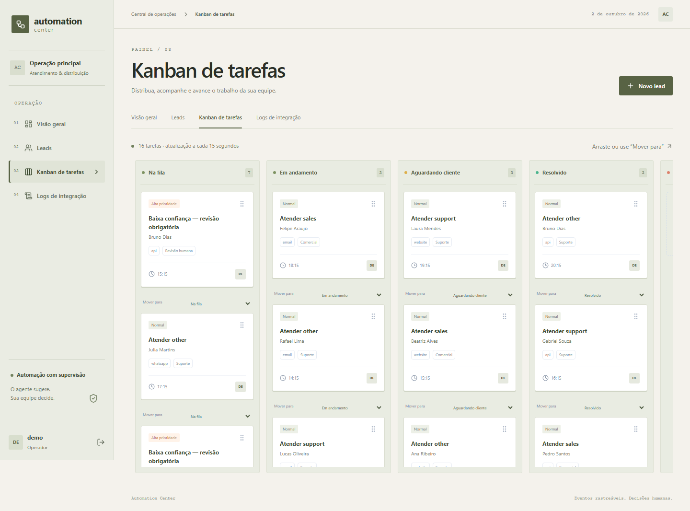
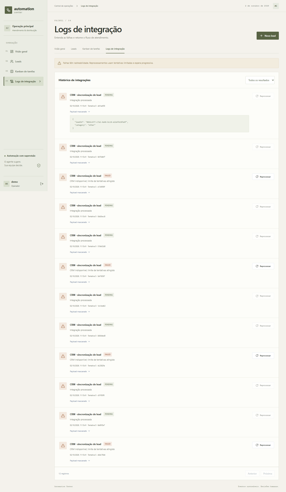
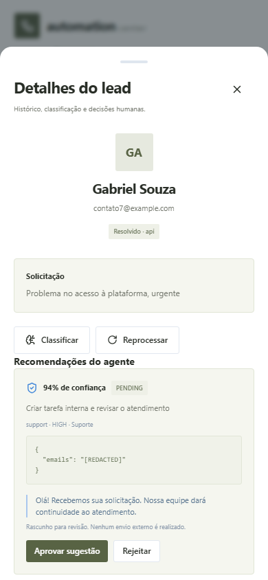

# Automation Center

Central de automação de atendimento, leads e tarefas operacionais. Um produto de demonstração com API autenticada, dados fictícios, distribuição por regras, classificação assistida e auditoria. Recebe solicitações por formulário, API e webhook simulado; cria tarefas internas e registra falhas e reprocessamentos.

## Arquitetura



### Eventos versus tarefas assíncronas

Kafka comunica fatos de negócio: `lead.created`, `lead.classified`, `task.created`, `integration.failed` e `lead.reprocessed`. Cada evento tem UUID e chave de partição do lead. `EventLog` é uma outbox: a criação do lead e do evento ocorre na mesma transação, sem depender da disponibilidade do broker. O scheduler publica pendências; o consumer só confirma o offset após a transação no banco. Um bloqueio no registro e `processed_at` tornam a aplicação do mesmo evento idempotente. A entrega é **pelo menos uma vez**, sem promessa de exactly-once entre Kafka e PostgreSQL.

Celery/Redis executa comandos de trabalho: publicar a outbox, tentar sincronizar o CRM, rotinas de SLA e reprocessamentos. A integração usa timeout, chave idempotente e até quatro retries com espera progressiva. O adaptador de CRM falha de propósito quando `INTEGRATION_URL` não está configurada, permitindo demonstrar o fluxo de falhas.

A movimentação do Kanban faz `PATCH` com status e versão. O servidor registra autor e estados anterior/novo em `EventLog`; uma versão desatualizada retorna `409`. TanStack Query aplica feedback otimista, restaura o cache em qualquer falha e busca o estado confirmado no servidor. O seletor “Mover para” oferece uma alternativa acessível ao arraste.

O status do lead acompanha suas tarefas; a resolução exige que todas estejam concluídas, inclusive revisões humanas. A tabela, os detalhes e o histórico são atualizados após uma movimentação.

## Tecnologias e organização

| Parte | Implementação |
|---|---|
| API | Python 3.12 no Docker/CI, Django 5.2, DRF, ORM, PostgreSQL, filtros e paginação |
| Eventos | confluent-kafka, outbox, consumer, confirmação manual de offsets |
| Trabalho assíncrono | Celery, Redis, retries, scheduler de SLA |
| Agente | `OperationsAgent`, JSON validado, adaptador mock/real e decisões auditadas |
| Interface | React, TypeScript, Vite, Tailwind CSS v4 e botão shadcn/ui |
| Dados e formulários | TanStack Query/Table, React Hook Form e Zod |
| Interação | DnD Kit, Motion com movimento reduzido e Vaul responsivo |
| Métricas | Gráfico Bklit oficial, volume por canal, SLA, falhas e automações |
| MicroKit | Tabs e botão de ação adaptados para estado real de sucesso/pending |
| Kokonut | Adaptação de Card Stack restrita ao vazio das filas do Kanban |
| Operação | Docker Compose, logs JSON, Prometheus, Grafana, GitHub Actions |
| Etapa posterior | Manifestos Kubernetes e roteiro de implantação |

Bencho não é usado: o produto não implementa Command Palette. Os componentes Bklit estão em `frontend/src/components/charts`; atribuições e adaptações estão em `THIRD_PARTY.md`.

```text
backend/config/             configuração, rotas e Celery
backend/operations/         modelos, API, serviços, agente, eventos e tarefas
backend/tests/              factories, fixtures, mocks e teste com Kafka real
frontend/src/components/    dashboard, tabela, Kanban, formulário, logs e drawer
frontend/e2e/               testes de navegador, incluindo DnD de verdade
infra/                      Prometheus, Grafana e Kubernetes
docs/evidence/              capturas reais da aplicação local
.github/workflows/          CI e publicação de imagens por release/manual
```

## Subir com Docker Compose

Requisitos: Docker Engine/desktop ativo e Docker Compose v2. Não é necessário instalar Python ou Node no host.

```bash
cd automation-center
cp .env.example .env
# Ajuste as senhas e segredos em .env antes de iniciar.
docker compose up --build -d
docker compose exec backend python manage.py seed_demo
```

No PowerShell, substitua `cp` por `Copy-Item .env.example .env`. As migrações são executadas por um serviço próprio antes da API, consumer e workers.

Se as portas padrão estiverem ocupadas, configure `BACKEND_PORT`, `FRONTEND_PORT`, `PROMETHEUS_PORT` e `GRAFANA_PORT` em `.env`. O serviço `kafka-init` prepara a permissão do volume antes de iniciar o broker com usuário sem privilégios.

| Serviço | Endereço |
|---|---|
| Interface | http://localhost:8080 |
| Swagger | http://localhost:8000/api/docs |
| OpenAPI | http://localhost:8000/api/schema |
| Prometheus | http://localhost:9090 |
| Grafana | http://localhost:3000 |

Entre com usuário `demo` e a senha definida em `DEMO_PASSWORD`. O seed é idempotente e só define a senha na primeira criação do usuário. Grafana usa `admin` e `GRAFANA_PASSWORD`. Use `docker compose logs -f backend consumer worker beat` para acompanhar a operação. `docker compose down` preserva volumes; `down -v` apaga os dados locais.

O seed cria clientes e leads fictícios, canais, regras, tarefas em diferentes estados, responsáveis por equipe, recomendações e falhas. A API usa autenticação Basic em memória no navegador; a senha não é persistida em localStorage. Apenas administradores e o grupo `Operators` podem escrever; outros usuários autenticados têm leitura. Regras de automação exigem administrador. Use o Django admin para cadastrar usuários e grupos.

## API e fluxo demonstrável

| Método | Rota | Uso |
|---|---|---|
| POST / GET | `/api/leads` | Criar / buscar, filtrar, paginar e ordenar leads |
| GET / PATCH | `/api/leads/{id}` | Detalhes e atualização de dados |
| POST | `/api/leads/{id}/classify` | Classificação explícita |
| POST | `/api/leads/{id}/reprocess` | Novo evento na outbox; retorno 202 |
| GET | `/api/leads/{id}/timeline` | Eventos e recomendações |
| GET | `/api/dashboard/metrics` | Indicadores operacionais |
| GET | `/api/integration-logs` | Logs com payload mascarado |
| POST | `/api/integration-logs/{id}/reprocess` | Agendar retry da integração |
| POST / GET | `/api/automation-rules` | Administração de regras |
| GET | `/api/tasks` | Tarefas e responsáveis |
| PATCH | `/api/tasks/{id}/status` | Persistência do Kanban com controle de versão |
| POST | `/api/recommendations/{id}/decide` | Aprovar/rejeitar sugestão e auditar autor/motivo |
| POST | `/api/webhooks/leads` | Webhook simulado com segredo e idempotência |

Filtros de leads: `status`, `priority`, `category`, `channel__slug`; busca: `search`; paginação: `page`; ordenação: `ordering=-created_at`. A tabela usa consultas ao servidor. As filas carregam todas as páginas de tarefas e atualizam a cada 15 segundos.

```bash
curl -u "demo:SUA_SENHA" http://localhost:8000/api/leads \
  -H 'Content-Type: application/json' \
  -d '{"customer":{"name":"Ana Exemplo","email":"ana@example.com","phone":""},"channel":"website","content":"Quero orçamento para o plano empresarial"}'

curl http://localhost:8000/api/webhooks/leads \
  -H 'Content-Type: application/json' \
  -H 'X-Webhook-Secret: SEU_SEGREDO' -H 'Idempotency-Key: demo-webhook-001' \
  -d '{"customer":{"name":"Cliente Exemplo","email":"contato@example.com"},"channel":"api","content":"Problema no acesso, urgente"}'
```

O webhook repetido com a mesma chave retorna o lead já criado. Um lead criado normalmente aguarda Kafka; para uma demonstração local sem brokers, a ação “Classificar” executa o mesmo serviço de classificação de forma explícita.

## OperationsAgent

O padrão é `AGENT_ADAPTER=mock`, determinístico e sem chamadas externas. As ferramentas internas são `getLead`, `searchAutomationRules`, `createInternalTask`, `addTag` e `requestHumanReview`.

```json
{
  "category": "sales",
  "priority": "MEDIUM",
  "extractedEntities": {"emails": "[REDACTED]"},
  "confidence": 0.94,
  "suggestedTeam": "Comercial",
  "recommendedAction": "Criar tarefa interna e revisar o atendimento",
  "draftResponse": "Olá! Recebemos sua solicitação. Nossa equipe dará continuidade ao atendimento.",
  "requiresHumanApproval": true
}
```

Confiança abaixo de `0.80` cria revisão humana. Termos e padrões sensíveis detectados bloqueiam o rascunho e também criam revisão. Todas as respostas exigem aprovação humana. A decisão registra usuário, data, resultado e motivo; **nenhuma ferramenta envia mensagem externa**, inclusive após aprovação.

Para usar um serviço real, configure `AGENT_ADAPTER=real`, `AGENT_API_URL` e `AGENT_API_KEY`. Esse endpoint deve aceitar `{content, channel, instruction}` e retornar o JSON acima. Conteúdo enviado é mascarado; a resposta passa pelo serializer antes de qualquer decisão. Trata-se de um adaptador HTTP, sem acoplamento a um fornecedor de IA. O detector de dados sensíveis é demonstrativo e deve evoluir com política de dados e avaliação antes de uso corporativo.

## Dados mascarados

Use somente dados fictícios nas demonstrações e fixtures. Payloads e entidades de auditoria passam por mascaramento recursivo de e-mails, telefones, CPF e chaves como nome, conteúdo, senha, token e segredo. O serviço de CRM envia apenas ID do lead e categoria; erros externos são substituídos por mensagens controladas, sem gravar respostas ou credenciais nos logs.

Dados do cliente e conteúdo permanecem no cadastro de leads para atendimento autenticado. Mascaramento não substitui autorização, criptografia ou política de retenção. Revise o mascaramento quando acrescentar novos campos; testes incluem estruturas aninhadas. Logs de aplicação são JSON com IDs de correlação de eventos, sem payload bruto.

## Testes

```bash
# Testes com PostgreSQL do Compose; Kafka real é selecionado separadamente.
docker compose run --rm backend pytest -q -m 'not kafka'
docker compose run --rm -e KAFKA_INTEGRATION=1 backend pytest -q -m kafka

cd frontend
npm ci
npm test
npm run build
npx playwright install chromium
npm run test:e2e
```

Os testes Python usam pytest-django, factory-boy, fixtures e mocks para validação, parsing, permissões, regras, agente, mascaramento, auditoria, outbox, retries, SLA e controle de versão. O teste Kafka publica em broker real e verifica consumo idempotente. Os testes React cobrem formulário, logs e permissões. Playwright exerce movimentos reais do mouse no DnD e confirma o PATCH e o rollback quando a API retorna conflito; sua API é simulada de forma explícita para testes determinísticos.

A CI usa Python 3.12 com PostgreSQL, compila o front-end, executa testes de navegador, valida migrações/OpenAPI e roda integração com Kafka no Compose. A publicação de imagens GHCR é um workflow de release por tag `v*` ou execução manual; os manifestos Kubernetes são a etapa posterior e não foram aplicados a um cluster.

Para desenvolvimento sem Docker, crie um ambiente Python, instale `backend/requirements.lock.txt` e configure variáveis PostgreSQL. `SQLITE_TEST=1` habilita um modo local de demonstração/teste; ele não valida os bloqueios concorrentes de PostgreSQL. Execute migrações, seed e `manage.py runserver`; depois `npm run dev` no front-end, que encaminha `/api` para a porta 8000.

## Evidências visuais

As imagens abaixo são capturas do React conectado à API Django local com dados fictícios do seed. Não representam validação de Kafka/PostgreSQL em produção.

### Dashboard


### Kanban


### Logs


### Lead no mobile


Consulte `docs/VALIDATION.md` para os resultados executados neste ambiente e `infra/k8s/README.md` para preparar a implantação posterior.

## Isolamento dos testes Kafka

Os eventos de negócio mantêm seus nomes (`lead.created`, `task.created` etc.). No broker, `KAFKA_TOPIC_PREFIX` adiciona o namespace `automation-center.`. Cada execução do teste Kafka usa um namespace UUID exclusivo, evitando misturar eventos de bancos temporários com o consumer da aplicação. Use um namespace próprio por ambiente.
